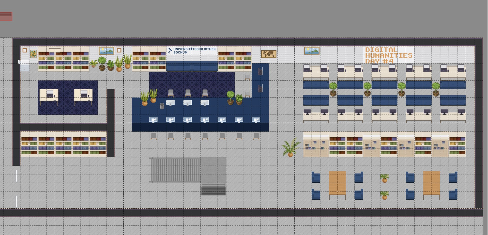

# WorkAdventure Map for the [Digital Humanities Day #4](https://dhday.rub.de/)



This [WorkAdventure](https://workadventu.re) map depicting the ground floor of the [University Library Bochum](http://www.ub.rub.de/) was created for the [Digital Humanities Day #4](https://dhday.rub.de/) at [Ruhr University Bochum (RUB)](https://www.ruhr-uni-bochum.de/). As a two-day online conference, DH Day promotes the visibility of the breadth of digital approaches and the networking of RUB's scholars working with Digital Humanities. For more information about DH Day, please visit our [conference website](https://dhday.rub.de/).

This repository is maintained by the [Digital Humanities Center](https://dh.ub.rub.de/). To understand how to create your own map, follow the tutorial at [https://workadventu.re/map-building](https://workadventu.re/map-building).

## Installation

With npm installed (comes with [node](https://nodejs.org/en/)), run the following commands into a terminal in the root directory of this project:

```shell
npm install
npm run start
```

## Licenses

The map was based on the [WorkAdventure Map Starter Kit](https://github.com/thecodingmachine/workadventure-map-starter-kit) and its artwork was customized by Natalie Rosenkranz with [Tiled](https://www.mapeditor.org/).

This project contains multiple licenses as follows:

* [Code license](./LICENSE.code) *(all files except those for other licenses)*
* [Map license](./LICENSE.map) *(`map.json` and the map visual as well)*
* [Assets license](./LICENSE.assets) *(the files inside the `src/assets/` folder)*
